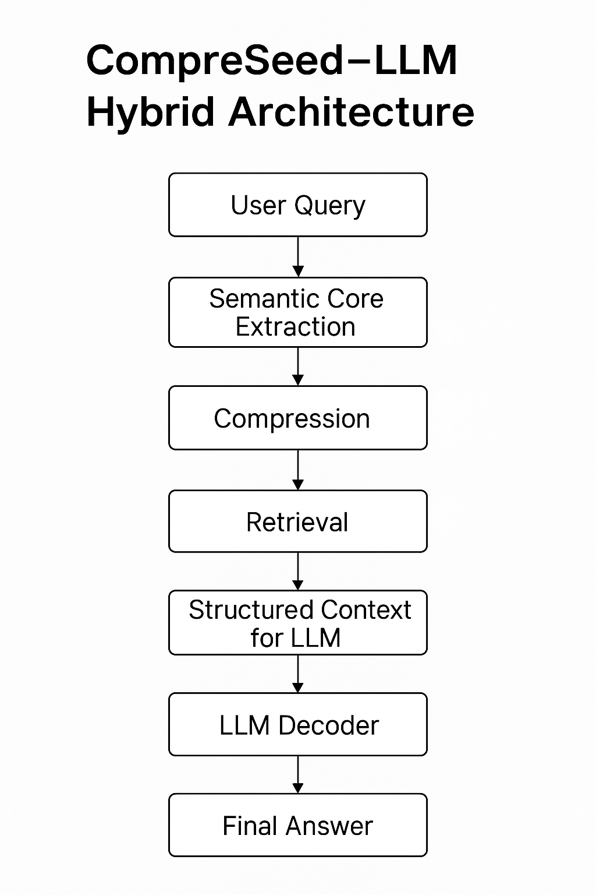

# CompreSeed–LLM Hybrid Architecture  
A CPU-Based, Hallucination-Resistant Semantic Memory System for Large Language Models

CompreSeed is a next-generation **semantic-core retrieval system** that compresses millions of documents into compact, irreversible knowledge units and retrieves them **only on CPU** with high stability and speed.  
It solves key limitations of modern LLMs:

- Hallucination  
- Lack of long-term memory  
- High computational cost  
- Dependence on embeddings & vector databases  
- Instability across repeated queries

This repository provides a safe demonstration of the CompreSeed–LLM hybrid pipeline.  
The proprietary algorithms are patent-protected and not included.

---

## 🚀 Why CompreSeed?

### ✔ No GPU required  
3M documents → compressed to ~1.8GB, retrieval in **0.2–0.8 sec on CPU**.

### ✔ No embeddings / no vector DB  
CompreSeed uses irreversible semantic cores instead of embeddings.

### ✔ Stable, deterministic retrieval  
The LLM receives clean structured context → near-zero hallucination.

### ✔ Persistent knowledge layer  
Millions of documents can be stored and expanded without reprocessing.

---
## 🧠 Architecture Overview
The following diagram illustrates the end-to-end flow of the CompreSeed–LLM hybrid semantic memory system.



User Query
↓
CompreSeed (Semantic Core Extraction → Compression → Retrieval)
↓
Structured Context for LLM
↓
LLM Decoder
↓
Final Output


---

## 📁 Repository Contents (Demo Only)
/mock_semantic_core.py - Demonstration of semantic-core extraction
/mock_retrieval.py - Mock CPU-based retrieval
/hybrid_pipeline_demo.py - Integration with LLM (GPT-4o example)
/docs/whitepaper.pdf - Full technical whitepaper (CompreSeed–LLM Architecture)
/docs/diagram.png - Architecture diagram


**Note:**  
This repository contains *only safe demonstration code*.  
Actual CompreSeed algorithms remain proprietary and/or patent-protected.

---

## 🧪 Demo Code (Safe & Non-Reconstructive)

### 1. Mock Semantic Core Extraction

```python
def extract_semantic_core(text):
    return {
        "core_terms": text.lower().split()[:5],
        "hash": hash(text) % (10**12)
    }

2. Mock Retrieval
def retrieve_core(query, database):
    q = set(query.lower().split())
    scored = []
    for doc_id, core in database.items():
        score = len(q & set(core["core_terms"]))
        if score > 0:
            scored.append((doc_id, score))
    return sorted(scored, key=lambda x: -x[1])

3. LLM Integration Example
from openai import OpenAI
client = OpenAI()

def hybrid_query(query, db, top_k=3):
    results = retrieve_core(query, db)[:top_k]
    context = "\n".join([f"Doc {i}: {db[i]['core_terms']}" for i, _ in results])

    prompt = f"Context:\n{context}\n\nQuestion: {query}\nAnswer:"
    response = client.chat.completions.create(
        model="gpt-4o",
        messages=[{"role": "user", "content": prompt}]
    )
    return response.choices[0].message["content"]
📘 Whitepaper

Full architecture & prototype details:
/docs/whitepaper.pdf

✉ Contact

Yoshikazu Nakamura
Aichi, Japan
info@xinse.jp
